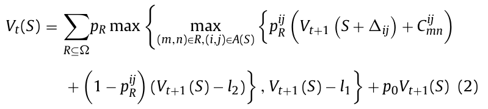
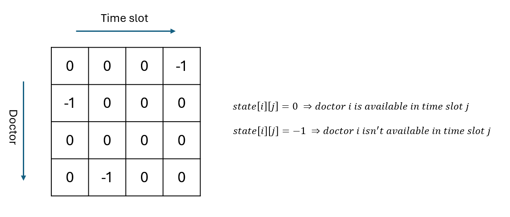

# Dynamic Programming Algorithm for Appointment Scheduling with Patient Preferences

> Task Seleksi Lab IRK created by Haziq

versi **08/07/24**

## 💡 Latar Belakang

Sudah lelah dengan task-task dengan beragam fungsionalitas dan platform tapi algoritmanya cuma numpang lewat? Nah, kali ini aku mencoba membuat task seleksi yang menitikberatkan strategi algoritmanya, yaitu Dynamic Programming (DP), tapi tetap praktikal tentunya. Terdengar menakutkan? Worry not, karena aku akan ngasih guide **bagi kalian yang kesusahan nyari ide strateginya 😄**. Sebenernya sih aku pengen bikin kalian punya project yang relatif kompleks dan worthy untuk dimasukkan ke portfolio tanpa harus menderita GERD hahahah.

 
  <b>Fig 1.</b> Ceritanya kalian kerja disini yak
 

 

Sebagai seorang software engineer yang bekerja di sebuah rumah sakit, kalian diminta untuk membuat aplikasi berbasis web yang berguna untuk menjadwalkan appointment pasien berdasarkan preferensi pasien yang bertujuan untuk memaksimalkan revenue rumah sakit. Persoalan ini terisnpirasi dari jurnal [berikut](https://www.sciencedirect.com/science/article/abs/pii/S0933365714001390?fr=RR-2&ref=pdf_download&rr=89cf0f0fee683dd5)

 
  <b>Fig 2.</b> Siapa sih yang ga pusing ngeliat simbol sebanyak ini?
 

 

Aku mencoba untuk mensimplifikasi persoalannya karena persoalan di jurnal tsb agak terlalu kompleks wkwkwk. Boleh melihat jurnal tersebut sebagai referensi, tapi harusnya ga terlalu membantu sih, karena detail permasalahannya aku ubah dan aku cuma ambil abstraksi awalnya aja.

> Lalu bagaimana detailnya? Apa hubungannya dengan DP?

### Persoalan

Misal terdapat `M` dokter $[d_{0}, d_{1},..., d_{M-1}]$ dan `N` time slots $[t_{0}, t_{1},..., t_{N-1}]$, sehingga terdapat maksimal `M x N` appointment yang dapat diisi oleh pasien. Terdapat pula `K` pasien $[p_{1}, p_{2},..., p_{K}]$ yang masing-masing memiliki preferensi terhadap dokter dan time slot tertentu

yang terurut pada sebuah array seperti contoh berikut.

-   Pasien 1:

    -   Preferensi dokter: `[3, 1, 2]`
    -   Preferensi time slot: `[6, 7, 8]`

    Yang artinya: pasien 1 paling ingin membuat appointment dengan dokter 3 (preferensi paling tinggi), lalu dokter 1 (preferensi kedua tertinggi) dan dokter 2 (preferensi ketiga tertinggi). Selain dari tiga dokter tersebut bukanlah dokter yang ia prefer. Logika yang sama juga berlaku pada preferensi time slot. **Perlu diketahui bahwa preferensi dokter dan time slot dianggap bersifat independen satu sama lain**

Karena terdapat banyak pasien yang akan membuat appointment dan memiliki preferensi masing-masing (dan tidak menutup kemungkinan preferensi pasien-pasien tersebut saling conflict satu sama lain), kalian diminta untuk membuat algoritma penjadwalan appointment, di mana kalian akan menentukan kombinasi penjadwalan pasien yang dapat memaksimalkan revenue.

> Apa itu revenue?

Revenue adalah pendapatan perusahaan (as simple as that). Namun pada persoalan ini, kita dapat mengasumsikan revenue adalah sebuah fungsi yang nilainya proporsional/berbanding lurus dengan kepuasan pasien (satisfaction).

$$
\begin{equation}
Revenue() \propto \sum_{patient=1}^K Satisfaction(patient, assigned\_doctor, assigned\_time\_slot)
\end{equation}
$$

> Lalu apa itu satisfaction?

Pada persoalan ini, satisfaction dihitung dari kesesuaian antara dokter yang didapatkan pasien dengan preferensi serta kesesuaian time slot yang didapatkan pasien dengan preferensi

$$
\begin{equation}
Satisfaction(patient, i, j) = S_{doc}(patient, i) + S_{time}(patient, j)
\end{equation}
$$

Pada persamaan di atas, satisfaction seorang patient terhadap appointment `(i, j)` dihitung dengan tingkat kesesuaian preferensi pasien dengan dokter `i` ditambah dengan tingkat kesesuaian preferensi pasien dengan time slot `j`

> Oke, sekarang lanjut ke $S_{doc}$ dan $S_{time}$. (bang udah bang 😭)

$$
\begin{equation}
S_{doc}(patient, i) = \left\{
        \begin{array}{ll}
            NUM\_PREFERENCE - indexOf(i) & \quad if\  i\  in\  patient's\  doctor\  preference \\
            0 & \quad otherwise
        \end{array}
    \right.
\end{equation}
$$

$$
\begin{equation}
S_{time}(patient, j) = \left\{
        \begin{array}{ll}
            NUM\_PREFERENCE - indexOf(j) & \quad if\  j\  in\  patient's\  timeslot\  preference \\
            0 & \quad otherwise
        \end{array}
    \right.
\end{equation}
$$

Intinya, $S_{doc}$ dan $S_{time}$ berhubungan dengan posisi dokter dan time slot tersebut pada array preferensi pasien. Misal kita ambil contoh pasien 1 di atas.

-   `NUM_PREFERENCE` bernilai 3, karena terdapat 3 elemen pada array preference.
-   Karena array preferensi dokter bernilai `[3, 1, 2]`, maka dokter 3 memiliki nilai $S_{doc}$ sebesar 3, lalu dokter 2 memiliki nilai $S_{doc}$ sebesar 2, lalu dokter 1 memiliki nilai $S_{doc}$ sebesar 1. Selain dari ketiga dokter tersebut memiliki nilai $S_{doc}$ sebesar 0.
-   Karena array preferensi time slot bernilai `[6, 7, 8]`, maka time slot 6 memiliki nilai $S_{time}$ sebesar 3, lalu time slot 7 memiliki nilai $S_{time}$ sebesar 2, lalu time slot 8 memiliki nilai $S_{time}$ sebesar 1. Selain dari ketiga time slot tersebut memiliki nilai $S_{time}$ sebesar 0.
-   Misalkan pada kasus real, pasien tersebut diassign dengan appointment `(1, 6)` (dokter = 1, time slot = 6), maka `Satisfaction` bernilai `2 + 3 = 5`
-   Contoh kasus lain, misal pasien tersebut diassign dengan appointment `(3, 4)` (dokter = 3, time slot = 4), maka `Satisfaction` bernilai `3 + 0 = 3`

     

> Oke, karena formulanya udah dijelasin semua, jadi aku akan summarize persoalannya.

Jadi intinya, kalian mencari arrangement/kombinasi appointment untuk setiap pasien **menggunakan Dynamic Programming**, di mana kombinasi appointment tersebut harus memaksimalkan nilai `Revenue`, yaitu sum dari seluruh `Satisfaction` pasien.

> Kenapa harus DP? Kenapa gak FIFO aja, pasien yang duluan bisa dapet preferensi tertinggi, dan jika preferensi tertinggi sudah diambil, coba ke preferensi selanjutnya?

Karena pendekatan FIFO/greedy seperti itu meskipun lebih fair, tapi tidak menjamin nilai `Revenue` yang optimal, karena begitu pasien sudah diassign, tidak dapat mundur lagi, padahal bisa saja setelah mengecek pasien lain, ternyata ada arrangement yang lebih optimal. Sebagai pekerja rumah sakit, ceritanya kita lebih mementingkan revenue dibandingkan fairness (wkwkw canda ya)

#### Beberapa asumsi yang dapat digunakan untuk mempermudah persoalan

-   `K <= M x N`, banyaknya pasien yang mendaftar diasumsikan tidak lebih dari banyaknya dokter x banyaknya time slot
-   `NUM_PREFERENCE` bernilai konstan untuk setiap pasien, dan berlaku untuk preferensi dokter dan preferensi time slot (dalam artian, setiap pasien harus memasukkan preferensi sejumlah `NUM_PREFERENCE`).
-   Bebas memilih nilai `NUM_PREFERENCE`-nya berapa, asal `NUM_PREFERENCE >= 3`, `NUM_PREFERENCE <= M`, dan `NUM_PREFERENCE <= N`

> Masih pusing mikirin strategi DP nya? Bisa lihat [guide ini](https://docs.google.com/document/d/1K1rbA1WRRono6D1tp6UNDw9TZwBM1uFnOvjMykYW3Hw/edit?usp=sharing) ya (usahakan cari ide sendiri terlebih dahulu, karena poinnya akan lebih tinggi kalo nyari ide sendiri). Kalian harus melakukan request access dan menggunakan akun std untuk membuka docs tersebut. **DILARANG** menyebarkan docs atau konten docs ini kepada siapapun.

## 📝 Spesifikasi Tugas

### Spesifikasi Wajib (2800 Poin)

1. Buatlah modul algoritma yang memuat fungsi/class DP, yang menerima input berupa state awal appointment dan array of patient preferences (berisi preferensi dokter dan time slot dari masing-masing pasien). Yang direturn adalah state akhir hasil asignment tiap patient dengan appointment
    - Berikut adalah contoh representasi state awal appointment
        

        
         
        <b>Fig 3.</b> Contoh representasi state awal
         
        

         
    - Modul ini harus benar-benar **decoupled/terpisah** dari modul lain, agar mudah melakukan testing untuk test case yang besar melalui CLI
2. Buatlah modul otentikasi pengguna dengan akun menggunakan email dan password. Terdapat dua role akun yang harus diimplementasikan, yaitu

    - Admin, yang dapat melakukan hal berikut:
        - Mengatur state awal appointment
        - Membuka pendaftaran booking appointment
        - Menutup pendaftaran booking appointment
        - Mengirimkan hasil assignment ke patient
    - Patient, yang dapat melakukan hal berikut:
        - Melakukan booking appointment dengan mengisi preferensi dokter dan preferensi time slot
        - Mengonfirmasi assignment yang dikirim oleh admin (accept/cancel)

3. Buatlah modul Real-Time Communication (RTC) yang dapat mengirimkan notifikasi ke pasien yang bersangkutan apabila assignment telah ditetapkan. Setelah mendapat notifikasi, pasien akan mengonfirmasi apakah akan menyetujui (accept) atau membatalkan (cancel) appointment yang telah diassign tersebut. Seluruh appointment yang telah disetujui akan disimpan di database dan dapat dilihat pada halaman admin. Untuk menerapkan notifikasi ini, kalian memerlukan teknologi WebSocket, dan salah satu library yang dapat digunakan adalah Socket IO
4. Data terkait dokter dan time-slot disimpan di database. Dapat diasumsikan data-data tersebut sudah fix sehingga tidak perlu membuat modul untuk CRUD dokter dan time slot untuk spesifikasi wajib. Namun pastikan kalian membuat fungsi untuk melakukan seeding database
    - Data dokter setidaknya memuat:
        - ID dokter
        - Nama dokter
    - Data time slot setidaknya memuat:
        - ID time slot
        - Waktu mulai
        - Waktu selesai

**Berikut adalah flow aplikasi**

1. Admin login dan masuk ke halaman admin (Tidak wajib mengimplementasikan register untuk akun admin, anggap saja seluruh akun admin sudah tersimpan di database)
2. Admin mengatur state awal appointment dan membuka pendaftaran
3. Patient login dan masuk ke halaman patient (jika belum punya akun maka perlu register)
4. Patient melakukan booking dengan memasukkan preferensi dokter dan time slot
5. Ketika waktu pendaftaran habis, admin menutup pendaftaran. Secara otomatis, program akan memanggil modul DP untuk melakukan perhitungan kombinasi assignment yang optimal
6. Ketika proses perhitungan sudah selesai, aplikasi akan mengirimkan notifikasi ke seluruh patient yang sudah melakukan booking dan menanyakan konfirmasi terkait appointment yang telah diassign pada patient tersebut
7. Patient mengirimkan konfirmasi terkait appointment yang telah diassign (accept/cancel)
8. Jika patient accept, maka data appointment akan disimpan di database dan data tersebut dapat dilihat oleh admin. Kalian bisa membuat halaman khusus untuk melihat riwayat appointment yang sudah terkonfirmasi di sisi admin

### Spesifikasi Bonus (2300 Poin)

1. Optimasi Memori

    Salah satu kekurangan algoritma DP adalah banyaknya memori yang dibutuhkan. Buatlah optimasi yang dapat mengurangi penggunaan memori pada algoritma DP. Pengurangan penggunaan memori harus cukup signifikan dan dapat mengurangi kompleksitas ruang program. **misal:** dari $O(n^2)$ menjadi $O(n)$, atau dari $O(n)$ menjadi $O(1)$, bukan hanya menghemat beberapa byte saja.

2. Persistent Notification

    Jika kita hanya mengimplementasikan notifikasi real-time, maka user hanya akan menerima notifikasi jika ia sedang online. Jika notifikasi dikirimkan ketika user tidak sedang online, maka notifikasi tersebut tidak akan terlihat oleh user dan hanya akan hilang begitu saja. Oleh karena itu, sebelum mengirimkan notifikasi, simpan terlebih dahulu notifikasi tersebut di database dan buatlah endpoint untuk get notifications dari database. Dengan begitu, user bisa menghit endpoint tersebut ketika ia baru login, sehingga bisa melihat seluruh notifikasi termasuk notifikasi yang dikirim ketika ia sedang offline.

3. CRUD Dokter dan Time Slot

    Buatlah modul untuk melakukan CRUD dokter dan time slot dari aplikasi oleh admin, agar aplikasimu terasa lebih real.

4. NoSQL database

    Gunakan basis data NoSQL (misalnya MongoDB) untuk menyimpan data. Lumayan, bisa eksplor teknologi baru.

5. Caching

    Gunakan in-memory cache untuk menyipan data yang sering diakses ke dalam memori, agar tidak perlu terlalu sering disk access ke database. Salah satu teknologi yang dapat digunakan adalah Redis.

6. Docker

    Udah tau lah ya harus ngapain 😏

## 📂 Pengerjaan dan Pengumpulan

1. Buatlah repositori **private** pada github masing-masing dan invite `haziqam` dalam repositori tersebut.
2. Berkas yang dikumpulkan berupa **link rilis tag ke repositori github** yang telah dibuat dengan ketentuan sebagai berikut.
    - Memberikan tag `vn` pada commit terakhir Anda setiap kali ingin melakukan submisi dengan `n` adalah jumlah submisi yang telah dilakukan. (contoh: `v1` untuk submisi pertama).
    - **Tidak menggunakan _url shortener_** (bit.ly, shortlink, atau yang lain) saat melakukan pengumpulan _task_.
    - Anda dapat melakukan rilis dengan panduan [berikut](https://docs.github.com/en/repositories/releasing-projects-on-github/managing-releases-in-a-repository).
3. **Lakukan submisi** pada website seleksi IRK dengan menggunakan akun std.stei.itb.ac.id, **lakukan konfirmasi** ke LINE `@haziq.am`, dan **jadwalkan demo** dengan cara yang sama. Lakukan hal yang sama jika membuat rilis yang baru.
4. Jika terdapat pertanyaan dapat menghubungi LINE `@haziq.am`.

## 📌 Penilaian

| Posisi                                                      | Poin Seleksi  |
| ----------------------------------------------------------- | ------------- |
| Modul DP                                                    | 1000 - 1500\* |
| Modul auth                                                  | 300           |
| Modul RTC                                                   | 600           |
| Penyimpanan Data dokter, time slot, dan riwayat appointment | 400           |
| Bonus 1                                                     | 500           |
| Bonus 2                                                     | 300           |
| Bonus 3                                                     | 200           |
| Bonus 4                                                     | 300           |
| Bonus 5                                                     | 300           |
| Bonus 6                                                     | 200           |

\* Untuk yang melihat guide algoritma DP, maksimal point untuk modul DP hanya 1000. Silakan dipikir-pikir trade-off nya gimana. Misal 3 hari awal kalian coba kerjain webnya dulu sambil brainstorming algo DPnya. Kalo masih belum nemu, baru coba liat guide hehehe.

**Good Luck!**
